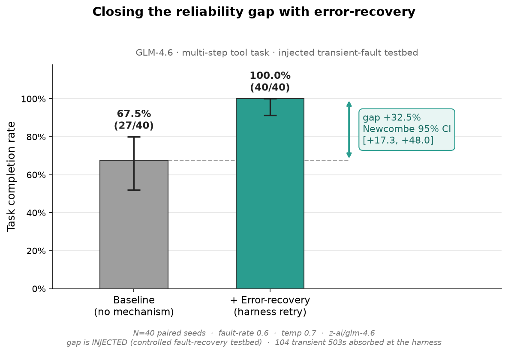
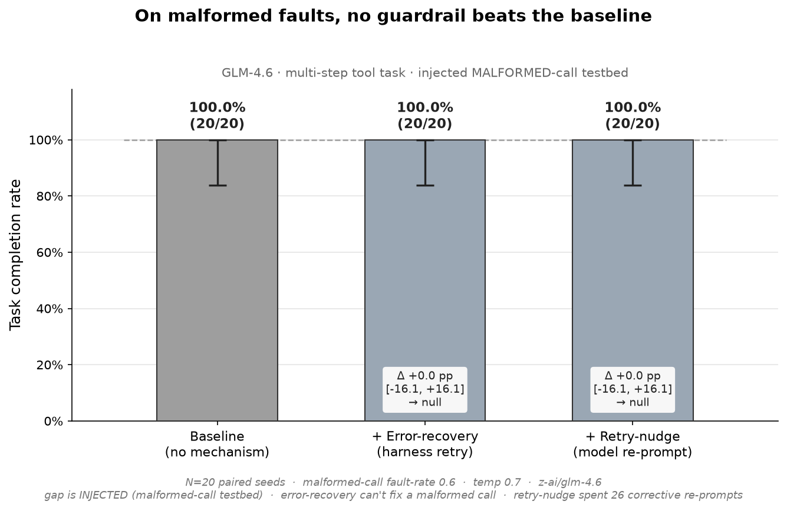
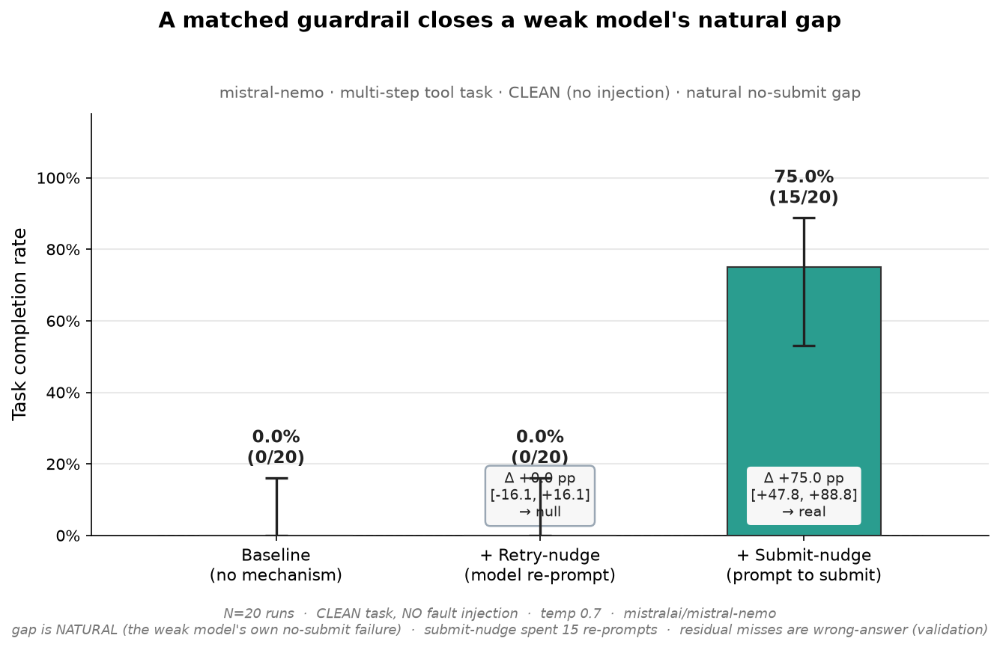
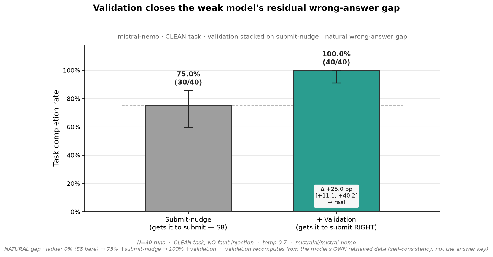

# forge-gap

The GLM-via-OpenRouter connection you'll build AI harnesses around. OpenRouter
exposes an **OpenAI-compatible** API, so this is a thin client over GLM-4.6 plus
a smoke test that proves both **chat** and **tool-calling** work.

```
forge-gap/
├─ glm.py              # the reusable client: chat(), MODEL  ← import this in harness code
├─ agent.py            # the reason→act→observe loop + grading (+ error-recovery / retry-nudge toggles)
├─ scenario.py         # the S2 lookup-then-compute task (2 tools + ground truth)
├─ oracle.py           # the deterministic grader (never an LLM judge)
├─ faults.py           # fault injectors: S3 transient-503 (with_faults) + S6 malformed-call (with_malformed_faults)
├─ runner.py           # S3 N-trial runner (run_arm): raw k/N per arm
├─ stats.py            # S4 Wilson + Newcombe confidence intervals
├─ ablation.py         # ablation harness: run_arms (N arms, S6) + run_ablation (2-arm legacy, S4), with CIs
├─ malformed_ablation.py # S6 three-arm malformed-call ablation: baseline / +error-recovery / +retry-nudge
├─ chart.py            # the deliverables: renders the S5 gap-closure + S6 malformed-gap + S8 weak-gap + S9 validation figures from saved numbers
├─ weak_ablation.py    # the S8 clean 3-arm ablation on a weak model (baseline / +retry-nudge / +submit-nudge)
├─ validation_ablation.py # the S9 stacked 2-arm ablation on a weak model (submit-nudge reference / +validation)
├─ verify.py           # smoke test: plain chat + one tool-calling round-trip
├─ test_*.py           # offline unit tests (oracle, faults, runner, stats, recover, ablation, chart, malformed, nudge, submit_nudge, validation)
├─ docs/figures/       # the committed gap-closure + malformed-gap + weak-gap + validation charts (PNG) + their vendored data (JSON)
├─ .env            # your key lives here (gitignored)
├─ .env.example    # template
└─ pyproject.toml  # uv project (Python 3.11+, openai + python-dotenv + matplotlib)
```

## 1. Get your key

1. Sign in at **https://openrouter.ai** (Google / GitHub / email).
2. Add credits at **https://openrouter.ai/credits** — GLM-4.6 is a *paid* model, but
   cheap (~$0.40 / 1M input tokens). $5–$10 covers a huge amount of dev. *(Skip if you
   already have a balance.)*
3. Create a key at **https://openrouter.ai/keys** → **Create Key** → name it
   `forge-gap` → copy it (starts with `sk-or-v1-...`).

## 2. Drop the key in

Open `.env` and paste the key after `OPENROUTER_API_KEY=`, then save. That's it —
`.env` is gitignored, so the key never leaves your machine or gets committed.

## 3. Verify

```bash
cd ~/Desktop/forge-gap
uv run verify.py
```

`uv` builds the venv and installs deps on first run. Expected tail:

```
All checks passed - GLM-4.6 chat + tool-calling work. Ready to build.
```

## 4. Use it

```python
from glm import chat, MODEL

resp = chat([{"role": "user", "content": "Explain a retry nudge in one line."}])
print(resp.choices[0].message.content)
```

`chat(...)` forwards `tools=`, `tool_choice=`, `temperature=`, `max_tokens=`, etc.
straight to the API — that's the surface your harness logic (retry nudges, error
recovery, step enforcement) will wrap.

## 5. Run the agent (S2 — scenario + oracle)

`agent.py` runs the bare **reason → act → observe** loop on a multi-step tool task and grades
the result against known ground truth — *deterministically*, never with an LLM judge.

```bash
uv run agent.py
```

The default task (`scenario.py`) is a **lookup-then-compute** scenario: GLM looks up an order,
looks up the shipping rate for that order's zone (a *chained* lookup), adds them, and calls
`submit_answer` with the total. The oracle (`oracle.py`) compares GLM's submitted number to the
known answer (140 + 18 = **158**) and prints **PASS**/**FAIL**. Every step is appended to
`trajectory.jsonl` (gitignored) for hand-reading.

Offline, before spending API calls, run the unit tests:

```bash
uv run test_oracle.py
```

One run is a single sample — a PASS/FAIL *rate* over many runs (with confidence intervals) is
what later sessions measure.

## 6. Measure the gap (S3–S4 — faults, arms, confidence intervals)

GLM-4.6 aces the clean task (S3: 20/20), so there's **no natural gap** to measure. To build and
measure the recovery guardrails honestly, S3 **injects** a deterministic, seeded transient 503 into
the lookup tools at a set rate — a *controlled fault-recovery testbed*, gap and rate disclosed, no
hidden thumb on the scale. S4 then compares two **arms** over the *same* injected faults:

- **baseline** — the bare loop, versus
- **+error-recovery** — the harness silently retries a transient fault, spending no model turn.

```bash
# needs your key in .env — this makes real GLM calls (~N×2 trials)
uv run ablation.py z-ai/glm-4.6 40 0.6     # args: model, N distinct seeds, fault rate
```

It prints each arm's completion rate with a **Wilson** confidence interval, the **gap closed**
between them with a **Newcombe** interval, and a one-line verdict — *a real result* only if that
interval clears 0; if it straddles 0 we report "no clear effect," never a win. The gap is always
stated as **injected** (see `docs/DECISIONS.md` D12). Offline, the logic is covered without API
calls by `uv run test_stats.py`, `test_recover.py`, and `test_ablation.py`.

## 7. The result (S5 — the gap-closure chart)

The deliverable: how much the **error-recovery** guardrail closes the injected gap — drawn
straight from the saved S4 numbers, no re-run.



On the injected transient-fault testbed (N=40 paired seeds, fault-rate 0.6, temp 0.7), GLM-4.6
completes the task **67.5%** of the time with no help (Wilson 95% CI [52.0%, 79.9%]) and **100%**
with harness-level error-recovery (Wilson 95% CI [91.2%, 100%]) — a **+32.5%** gap closed,
Newcombe 95% CI **[+17.3%, +48.0%]**. The interval clears 0 *and* the two Wilson bars don't
overlap, so it's a real result by the project's honesty rule — and *not* a natural gap: the
failures are injected 503s the harness absorbs (104 of them), a controlled fault-recovery testbed,
stated plainly on the figure itself.

Regenerate it from the vendored numbers — no API, no model call:

```bash
uv run chart.py     # reads docs/figures/gap-closure-data.json -> docs/figures/gap-closure.png
```

## 8. The boundary (S6 — retry-nudge, and where a guardrail stops helping)

S4 measured one guardrail against one fault. S6 added the second guardrail — **retry-nudge** (re-prompt
the *model* to fix and retry a failed call, costing a model turn) — and tested it against the fault it
is built for: a **malformed call**, where the model's *own* call is wrong. A new injector
(`with_malformed_faults`) rejects the documented parameter with an informative `400 … use 'id' instead`
hint; it is *permanent* (so error-recovery's transient-only retry can't touch it) and *sticky* (only a
genuinely corrected call clears it). Three arms run over the same malformed faults:



**The honest result is a null: no guardrail beats the baseline.** GLM-4.6 reads the hint *as a tool
result* and corrects its own call on the next turn, completing **20/20 = 100%** with no mechanism at
all. Error-recovery can't help (a malformed call isn't a transient one) and retry-nudge — though it
fired **26** corrective re-prompts — adds nothing the model wasn't already doing: **+0.0%**, Newcombe
95% CI **[−16.1%, +16.1%]**, which straddles 0. Reported as a null, per the honesty rule.

That negative result is the point, and it sharpens S4: a guardrail earns its keep only where the model
**can't help itself**. S4's +32.5% came specifically from *turn-exhaustion* — transient faults made GLM
retry until it ran out of steps, and a no-turn harness retry rescued it. Malformed calls don't exhaust
turns (GLM fixes them in one extra step), so neither guardrail moves the number. The matched-guardrail
intuition has a boundary, and it's the model's own competence.

```bash
# needs your key in .env — real GLM calls (~N×3 trials); regenerate the figure with `uv run chart.py`
uv run malformed_ablation.py z-ai/glm-4.6 20 0.6     # args: model, N distinct seeds, fault rate
```

Offline, the mechanism + fault are covered without API calls by `uv run test_malformed.py` and
`uv run test_nudge.py`. The full reasoning is in `docs/DECISIONS.md` **D19**.

## 9. The natural gap (S8 — a weak model, and a guardrail that finally fires on its own)

S3–S7 studied GLM-4.6, which is robust enough that its gaps had to be *injected*. S8 flips the variable:
hold the task fixed and **clean** (no injection) and swap in a **weaker** model. Two fit pilots found a
**capability cliff** — neither weak model fails the way we pre-registered. `llama-3.1-8b` hallucinates the
final number even with the data in hand (a *validation* gap); **`mistral-nemo`** computes the right answer
(`158`) and then **never calls the terminal tool** — it narrates "calling submit_answer…" and stops (a
*no-submit* / *protocol* gap). So S8 built a NEW, matched guardrail — **submit-nudge**: when a run ends in
prose with nothing submitted, re-prompt the model to actually call the tool, then continue.



**This is the project's first *natural* (un-injected) gap-closure — and it shows guardrail specificity in one
picture.** On the clean task (mistral-nemo, N=20, temp 0.7): **baseline 0/20**, **+retry-nudge 0/20** (a
null — it fires **0** times, because a no-submit isn't a *failed* call), and **+submit-nudge 15/20 = 75%**, a
**+75.0 pp** gap, Newcombe 95% CI **[+47.8%, +88.8%]** — clears 0, with non-overlapping Wilson bars. The
*wrong* guardrail does nothing; the *matched* one lifts. The residual (5/20 submit `140`, shipping forgotten)
is a *validation* gap submit-nudge can't fix — parked as a separate experiment. The claim is the **capability ×
guardrail interaction**: a weak-but-tool-capable model needs a guardrail GLM-4.6 didn't.

```bash
# needs your key in .env — real model calls (~N×3 trials); regenerate the figure with `uv run chart.py`
uv run weak_ablation.py mistralai/mistral-nemo 20     # args: model, N runs (clean task, no injection)
```

Offline, the guardrail is covered without API calls by `uv run test_submit_nudge.py` and the vendored figure
data by `uv run test_chart.py`. The full reasoning is in `docs/DECISIONS.md` **D21**.

## 10. Submitting *right*, not just submitting (S9 — the validation guardrail)

S8 ended one guardrail short. Submit-nudge got mistral-nemo to *submit* — but ~25% of the time it submitted
`140` (the item total, with **shipping silently forgotten**). No tool errored; the model just summed wrong.
That's the **last** failure type the project hadn't closed — *wrong answer, no error* — and it's the first one
that's **semantic**, not mechanical: none of the three earlier guardrails (which fire only on a tool *error* or
a *missing* call) can even see it. S9 builds the fourth and final guardrail for it — **validation**.

**The honest hard part: validate *without* the answer key.** When the model calls `submit_answer(value)`, the
harness recomputes the total from **the data the model itself retrieved this run** (`get_order` → `140`,
`get_ship_rate` → `18`) and, on a mismatch, re-prompts it to recompute (naming the parts `140` and `18`, but
**not** the sum) and keeps looping. Crucially it reads **only the run's own tool results, never the oracle's
`ground_truth`** — so it's a *self-consistency* check ("does your answer match the evidence you gathered?"), not
an answer key. It can be *fooled* by a wrong-record retrieval (it would accept a self-consistent-but-wrong total;
the oracle still fails it), so it doesn't trivially force a pass — it closes only the *arithmetic-slip* slice of
the semantic gap, and the figure says so.



Because mistral-nemo's bare baseline is 0% (it never submits), there's nothing to validate until submit-nudge
lifts it — so this is a **stacked** ablation: hold submit-nudge fixed, toggle validation. Pilot-gated (N=8:
validation fired and lifted 75% → 100%), then the full run (mistral-nemo, N=40, temp 0.7): **submit-nudge
(reference) 30/40 = 75%**, **+validation 40/40 = 100%**, gap **+25.0 pp**, Newcombe 95% CI **[+11.1%, +40.2%]** —
clears 0, non-overlapping Wilson bars, a **real** result. Validation fired on **6/6** of the `140`s it ever saw
(pilot + full) and converted every one to a genuine `158`. The full ladder on this model is now **0% → 75% →
100%**, and every failure class now has its matched guardrail — transient→error-recovery, malformed→retry-nudge
(null), no-submit→submit-nudge, **wrong-answer→validation** — the project's thesis, complete.

```bash
# needs your key in .env — real model calls (N×2 trials); regenerate the figure with `uv run chart.py`
uv run validation_ablation.py mistralai/mistral-nemo 40   # args: model, N runs (clean task, stacked on submit-nudge)
```

Offline, the guardrail is covered without API calls by `uv run test_validation.py` and the vendored figure data
by `uv run test_chart.py`. The full reasoning is in `docs/DECISIONS.md` **D22**.

## Architecture & State Management

To isolate and measure the guardrail deltas accurately without cross-contamination, the evaluation harness is built with strict boundaries around concurrency and state:

* **The Error Boundary (Silent Recovery):** In the `+error-recovery` arm, transient failures (like 503s) are caught exactly at the tool-execution boundary via `dispatch_with_recovery`. The harness intercepts the failure and executes a bounded retry loop. Crucially, this happens *outside* the model's awareness—the 503s are never appended to the conversation history, preventing token-bloat and turn-exhaustion.
* **State Mutation (Retry Nudges):** For permanent errors like a 400 Malformed Call (in the `+retry-nudge` arm), the harness intentionally mutates state. It packages the error hint into a synthetic `user` message (e.g., "Your last tool call failed... correct the arguments") and appends it to the trajectory. This forces the model to spend a turn correcting its own syntax.
* **Non-error state mutation (Submit-nudge & Validation):** The two later guardrails fire on conditions where *no* exception is raised at all. **Submit-nudge** (S8) detects a turn that ended in prose with nothing submitted and appends a synthetic prompt to actually call the terminal tool. **Validation** (S9) intercepts the `submit_answer` call itself, recomputes the total from the model's *own* retrieved tool results (never the grader's ground truth), and on a mismatch appends a corrective prompt — a *self-consistency* check, so it catches a wrong answer that threw no error.
* **Trial Isolation:** `runner.py` executes an arm's N trials **sequentially**, each with its own fresh `messages` array and its own `trial-NN.jsonl` — so no state leaks between trials and every trajectory stays a clean, hand-readable record. The trials are independent samples of the model's stochasticity (not concurrent), which is why "N" means N *distinct* trials, never a re-pooling of the same run.

## Limitations & Next Steps

This project is a controlled testbed built to quantify mechanical agent failures. As a result, it has known boundaries:

* **The Semantic Blind Spot (now partly closed):** The first three guardrails fire only on *typed* failures — a tool **error** (HTTP 503 / 400) or a **missing** terminal call — so they can't see a wrong answer that raises no exception. **S9's validation guardrail closes part of that gap:** it recomputes the total from the data the model itself retrieved and rejects a mismatch (a *self-consistency* check, not an answer key). What stays blind is the harder slice — a **wrong retrieval** (a self-consistent *but wrong* answer) or a hallucination with no supporting evidence — which a self-consistency check structurally cannot catch.
* **The "Natural" gap needed a weaker model:** Frontier-grade GLM-4.6 proved robust enough that a *natural* gap never appeared (20/20 clean, self-heals malformed calls, 8/8 on a hardened task), so its guardrails had to be measured against **injected** faults (S3–S6), disclosed as such. Holding the task fixed and swapping in a **weaker** model (mistral-nemo, S8–S9) surfaced two real *natural* failures — never submitting (**+75 pp** from submit-nudge) and submitting a wrong total (**+25 pp** from validation) — the project's first un-injected gap-closures.
* **Next steps (optional — the core deliverable is complete):** (a) a **harder validation testbed** — Llama-3.1-8B *hallucinates* wrong numbers, a noisier wrong-answer gap than nemo's clean arithmetic slip, to measure how much of its gap is bad *retrieval* the self-consistency check can't reach; (b) a **capability ladder** — the same guardrails across 2–3 models for a lift-vs-capability curve; (c) a genuinely **self-hosted** local model (the original *Forge* framing) to recover an infrastructure-level gap directly rather than by injection.

## Reference
- OpenRouter quickstart: https://openrouter.ai/docs/quickstart
- OpenRouter tool-calling: https://openrouter.ai/docs/guides/features/tool-calling
- GLM-4.6 model page: https://openrouter.ai/z-ai/glm-4.6
