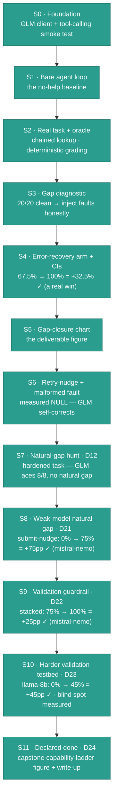

# forge-gap — Roadmap

**The project in one sentence:** reproduce and *measure* how much specific reliability
guardrails raise an open-weight model's (GLM-4.6, via OpenRouter) success rate on a multi-step tool task —
ending in a "gap-closure" chart with honest confidence intervals.

Stages are labelled **S0, S1, S2, …** — each is roughly one build session.

### Phase map — at a glance

**Legend:** 🟩 shipped (S0–S11) — **the project is complete**. Key measured outcomes live in the node itself: **S4 = +32.5% ✓** (error-recovery closes the injected gap), **S6 = null** (GLM self-heals malformed calls), **S7 = no natural gap** (a strong model doesn't break on its own — injected faults are required), **S8 = +75 pp ✓** (a *weak* model's natural no-submit gap, closed by a matched submit-nudge while retry-nudge nulls), **S9 = +25 pp ✓** (a *validation* guardrail, stacked on submit-nudge, closes the residual wrong-answer gap — completing the "each failure → its matched guardrail" thesis: 0% → 75% → 100% on mistral-nemo), **S10 = +45 pp ✓** (the same validation guardrail on llama-8b's *messy* hallucination gap — it recovers the checkable slice, and the 55% residual is the blind spot, hand-read and quantified), **S11 = declared done** (the capstone capability-ladder figure + the one-page write-up — no new measurements; the story is bracketed at both ends, so the project stops on purpose). The detailed table below is the source of truth; this map is its at-a-glance view.

| Stage | What it does (plain English) | Why it exists | Status |
|-------|------------------------------|---------------|--------|
| **S0** | Stands up the foundation: a tiny client (`glm.py`) that talks to GLM-4.6, plus a smoke test (`verify.py`) proving both plain chat **and** tool-calling work. | You can't build an agent until the connection — especially tool-calling — is proven. | ✅ done |
| **S1** | The bare **reason → act → observe** loop (`agent.py`): ask the model what to do, run the tool it asks for, feed the result back, repeat. **Zero** reliability features. | "Build the ugliest working version first." You need a no-help baseline before you can measure how much *any* help adds. | ✅ done |
| **S2** | Swaps the placeholder task for the **real** one: look up an order, look up its zone's shipping rate (a *chained* lookup), add them, submit the total — graded against the known answer (158) by a deterministic **oracle**, never another AI. | Gives the project a real task whose failures are *mechanical* ("called the wrong tool"), not *cognitive* ("bad at math") — the distinction the whole thesis rests on. | ✅ done |
| **S3** | Run that task **many times** on GLM-4.6 and hand-read the trajectories. **Result:** 20/20 — no *natural* gap (kill-trigger 1). Pivot (a *sequence*, not a fork): inject deterministic mechanical faults as the **foundation/floor** (a *controlled fault-recovery testbed*), then later tune harder for a **natural-gap stretch** that reuses the same harness + guardrails (DECISIONS D12). | Proves whether a gap exists and is the *fixable* kind — here the floor is manufactured honestly, with a natural gap as the stretch. Confirmed: rate-0.5 injection → 80% baseline, all-mechanical. | ✅ done |
| **S4** | The **first mechanism arm + the ablation runner**: add a toggleable **error-recovery** guardrail (the harness silently retries a transient tool fault, spending *no* model turn), then run **two arms** — baseline vs +error-recovery — over the *same* injected faults and compute proper confidence intervals (Wilson per arm + Newcombe on the gap between them). | Turns one-off runs into a *measurement of a difference*: the gap-closure number, with honest error bars instead of a bare k/N. | ✅ done — **measured**: 67.5% → 100%, **+32.5%** (Newcombe 95% CI [+17.3%, +48.0%]) at rate 0.6, N=40 |
| **S5** | Draw the **gap-closure chart** — turn S4's two measured arms into the project's headline figure (`chart.py` → `docs/figures/gap-closure.png`): two bars with **Wilson** whiskers, the **Newcombe** gap annotation, and an honesty caption. Reads the *saved* S4 numbers — no re-run. | The actual deliverable, made legible: one honest figure of how much error-recovery closes the injected gap. | ✅ done |
| **S6** | Add the **second guardrail (retry-nudge)** + the **malformed-call** fault it targets, and run a 3-arm ablation (baseline / +error-recovery / +retry-nudge) on that testbed. **Result: a measured NULL** — GLM self-corrects malformed calls unaided, so no guardrail beats the baseline. | Tests *where a guardrail helps* — and finds the boundary: only where the model can't self-correct. | ✅ done |
| **S7** | The **natural-gap hunt** (D12): drop injected faults and *harden the task itself* (a 4–5 lookup chain through ~25 confusable records, named by description so the model must disambiguate) until GLM fails on its own. Pilot-gated, with a bounded escalation. **Result: GLM aced it 8/8 (v1) and 8/8 (v2) — no natural gap.** | Tests the headline goal: does a strong model break on its own merits? It doesn't — so injected faults are the honest way to study guardrails here. | ✅ done — **no natural gap** (4th robustness signal) |
| **S8** | The **weak-model natural-gap** experiment: hold the task fixed and CLEAN, swap GLM-4.6 for a weaker model (`mistral-nemo`), and ablate a NEW **submit-nudge** guardrail (re-prompt a run that stalled without submitting). Pilot-gated; pivoted here after two weak models exposed *non-tool-error* failures. | Tests the **capability × guardrail interaction**: a weak-but-tool-capable model needs a guardrail GLM-4.6 didn't. | ✅ done — **measured**: 0% → 75%, **+75 pp** (Newcombe [+47.8, +88.8]); retry-nudge a null in the same run |
| **S9** | The **validation guardrail** (D22): stack a *self-consistency* check on submit-nudge — recompute the total from the model's OWN retrieved data (never the answer key) and re-prompt a mismatch — and measure its incremental lift on mistral-nemo's residual wrong-answer (`140`, shipping forgotten) misses. | Closes the **last** failure row — *wrong-answer, no error* — that error-recovery / retry-nudge / submit-nudge structurally can't see, **completing** the matched-guardrail thesis. | ✅ done — **measured**: 75% → 100%, **+25 pp** (Newcombe [+11.1, +40.2]); validation fired **6/6** genuine `140→158` corrections |
| **S10** | The **harder validation testbed** (D23): the *same* validation guardrail, un-stacked, on **llama-3.1-8b** — whose natural failure is *hallucinating* the final number. Ablate baseline vs +validation on the clean task, then **hand-read every miss** to decompose the residual into validation-catchable vs un-validatable. | Turns the validator's *disclosed* blind spot (D22) into a **measured number**: how much of a messy natural wrong-answer gap can self-consistency actually close? | ✅ done — **measured**: 0% → 45%, **+45 pp** (Newcombe [+28.2, +60.2]); residual = 35% never-retrieved · 10% wrong-record (validator fooled) · 7.5% non-numeric · 2.5% no-submit |
| **S11** | **Declare done + write-up** (D24): the **capstone capability-ladder figure** — three models on the clean task, baseline vs +matched-guardrails, derived entirely from already-measured numbers — plus README §12 (the whole story on one page) and the spine close-out. No model calls. | A finished measurement project ends with one legible figure and an honest statement of why it stops; the two roads not taken (live ladder sweep, self-hosted endpoint) are recorded as future *projects*, not pending stages. | ✅ done |

*(forge-gap ran **S0 → S11** and is **complete**: the headline chart shipped at **S5**, **S6–S10** layered and boundary-tested the remaining mechanisms one at a time, and **S11** closed the project with the capstone figure + write-up. The canonical cross-project tracker is `ACTIVE-PLAN.md` in the separate hub repo; this roadmap is the in-repo view.)*

> **Honesty rule (load-bearing):** the framing is always *"reproduced and measured a known
> primitive — here's the narrow, measured delta,"* never *"I invented this."* If a gap is
> manufactured by injecting faults rather than found naturally, the README/writeup says so.

**Where we are right now:** the S3 diagnostic is done — **GLM-4.6 scored 20/20 (100%)** on the
as-built task, verified genuine (every win used both lookups in the minimal 3 turns; none guessed).
A 100% baseline has nothing for a guardrail to recover, so there's **no natural gap** — the
pre-registered **kill-trigger 1**. Per the plan we don't build guardrails against a non-existent
gap. Instead we treat the two contingencies as a **sequence, not a fork**: **first** inject
deterministic mechanical faults (503-style tool errors) as the **foundation** — a guaranteed,
reproducible gap that also serves as the dev fixture for building the guardrails (the deliverable
**floor**: a *controlled fault-recovery testbed*, stated plainly). **Then**, as a **stretch**, tune
the scenario harder to surface GLM's *own* mechanical failures and re-run the same validated
guardrails for the stronger 'natural gap' result — the harness + mechanisms are shared, only the
fault layer toggles off (DECISIONS D12). The frontier (Claude Sonnet) arm was skipped as moot
(~100%). **Re-diagnosis result:** the injector (`faults.py`) + runner wiring are built and
offline-proven, and the GLM baseline under rate-0.5 injection scored **16/20 = 80%** (vs 100%
clean) — an injected gap that's 100% *mechanical* (all 4 misses are `max_steps` retry-exhaustion)
and recoverable (DECISIONS D13). Confirmed but mild; making it crisp (CIs vs the mechanism arm) is
what S4 builds.

**S4 done — the gap is real, and error-recovery closes it.** Built *and measured*: the
**error-recovery** guardrail (a harness-level `recover` toggle on the loop — it silently re-tries a
transient tool fault *without* spending a model turn), the **Wilson + Newcombe** confidence intervals
(`stats.py`), and the **two-arm ablation harness** (`ablation.py`). The live run at **rate 0.6, N=40
distinct seeds** (GLM-4.6): **baseline 27/40 = 67.5%** (Wilson 95% CI [52.0%, 79.9%]; all 13 misses
were `max_steps` retry-exhaustion) vs **+error-recovery 40/40 = 100%** (Wilson 95% CI [91.2%, 100%];
the harness absorbed **104** transient 503s, spending no model turns). **Gap closed: +32.5%, Newcombe
95% CI [+17.3%, +48.0%]** — the interval clears 0 *and* the two Wilson bars don't overlap, so it's a
real result by our honesty rule. All six offline suites stay green. The choices + measured result are
DECISIONS D14–D17. **Next (S5+):** add retry-nudge as a second arm and draw the gap-closure chart;
the **natural-gap stretch** (D12) remains the bigger prize.

**S5 done — the deliverable figure exists.** The two S4 arms are now drawn as the project's
headline **gap-closure chart** (`chart.py` → `docs/figures/gap-closure.png`): two bars — baseline
**67.5%** vs +error-recovery **100%** — each with its **Wilson 95% CI** as a whisker, the **+32.5%**
gap annotated with its **Newcombe 95% CI [+17.3%, +48.0%]**, and an honesty caption stating the gap
is *injected* (104 transient 503s absorbed). It reads straight from the *saved* S4 numbers (vendored
at `docs/figures/gap-closure-data.json`) — **no re-run, no API** — and regenerates with
`uv run chart.py`. Pure label/format helpers are covered offline by `test_chart.py`; all **seven**
offline suites stay green. The choice + design are DECISIONS **D18**. **Next (S6+):** add
**retry-nudge** as a second mechanism arm — heads-up, against the current 503 faults it will likely
measure **~null** (the bare loop already self-retries), so it only earns a real bar paired with a
failure it actually fixes (e.g. a malformed-call fault — a new `faults.py` type). The
**natural-gap stretch** (D12) is still the headline goal.

**S6 done — the second guardrail measured: a clean NULL (and that *is* the result).** We built the
second guardrail, **retry-nudge** (re-prompt the *model* to fix a failed call — a model turn, vs
error-recovery's no-turn harness retry), plus the fault it targets: a **malformed-call** injector
(`with_malformed_faults`) that rejects the documented parameter with a `400 … use 'id' instead` hint —
*permanent* (so error-recovery structurally can't touch it) and *sticky* (only a corrected call clears
it). A 3-arm ablation on that testbed (GLM-4.6, **N=20, rate 0.6**) measured **baseline 20/20 = 100% ·
+error-recovery 100% · +retry-nudge 100%** (the nudge arm fired **26** corrective re-prompts that changed
nothing) — both gaps **+0.0%**, Newcombe **[−16.1%, +16.1%]**, straddling 0 → **null** by the honesty
gate. The reason is GLM-4.6 itself: it reads the hint *as a tool result* and corrects its own call on the
next turn, so neither guardrail has work to do. The finding *sharpens* S4: a guardrail helps only where
the model **can't help itself** — S4's +32.5% was **turn-exhaustion** recovery, which malformed calls
don't cause. Figure: `docs/figures/malformed-gap.png` (README §8); along the way the machinery generalised
the harness to **N arms** (`run_arms`) and the chart to **N bars**, keeping the S4/S5 figure
byte-compatible. Choices + the measured null are DECISIONS **D19**. All **nine** offline suites green.
**Next (S7+):** the **natural-gap stretch** (D12) — drop injection, harden the task until GLM fails on its
own merits — remains the headline goal, now standing on a richer, two-fault testbed.

**S7 done — the natural-gap hunt: GLM-4.6 doesn't break on its own (a measured no).** The headline stretch
(D12): drop injected faults and *harden the task itself* until GLM fails on its own mechanical merits, then
re-run the guardrails. We built a hardened scenario (`scenario_hard.py`) — a 4-lookup chain (`find_orders` →
`get_order` → `get_ship_rate` → `get_customer_discount`) through 15 look-alike records, named by description so
the model must **disambiguate** — plus a clean, pilot-gated runner (`pilot.py`). **v1 pilot: 8/8 = 100%.** Per a
pre-agreed **bounded escalation** we pushed once more — "hard task v2": a 5-lookup chain (added per-zone tax)
through ~25 records with a near-duplicate-customer distractor ("Globex" vs "Globex Labs") — and got **8/8 =
100%** again, so we **declared done** (the ≥7/8 stop rule fired). Across four probes — 20/20 clean (S3),
self-heals malformed (S6), 8/8 v1, 8/8 v2 — **GLM-4.6 shows no measurable natural gap at reasonable mechanical
difficulty**; studying guardrails on it *requires* injected faults, exactly as S3–S6 did and disclosed. One
load-bearing insight shaped the hunt: the two guardrails only fix *tool-error* failures, but a hard task's
natural failures are mostly *wrong-answer, no-error* (a **validation** gap) which neither can see — so a found
gap would have reopened "build a third guardrail?" rather than rescued the existing two. Choices + the measured
result are DECISIONS **D20**. All **ten** offline suites green. **Next (S8+):** optional — further guardrails /
fault types / models; the project's honest deliverable (the injected gap-closure chart + the S6/S7 boundary
findings) is complete.

**S8 done — a *weak* model has a natural gap, and a matched guardrail closes it (+75 pp).** S7's finding
(GLM-4.6 never breaks naturally) raised the real question: is the *task* unbreakable, or is GLM just strong?
S8 answers it by flipping the variable — hold the task fixed and CLEAN (no injection), swap in a weaker model.
Two fit pilots mapped a **capability cliff**: `llama-3.1-8b` hallucinates a final number even with the data in
hand (a *validation* gap), and `mistral-nemo` computes the right answer (158) but **never calls the terminal
tool** — it narrates "calling submit_answer…" and stops (a *protocol* / no-submit gap). Neither is the
*malformed call* we pre-registered, and neither is visible to the existing arms — so S8 **pivoted** to build a
new, matched guardrail: **submit-nudge** (when a run ends in prose with nothing submitted, re-prompt it to
actually call the tool, then continue). The clean 3-arm ablation on **mistral-nemo, N=20**: **baseline 0/20 ·
+retry-nudge 0/20 (null — it never fires; a no-submit isn't a *failed* call) · +submit-nudge 15/20 = 75%**, gap
**+75.0 pp, Newcombe [+47.8, +88.8]** — clears 0, with non-overlapping Wilson bars: a **real** result. It is the
project's first *natural* (un-injected) gap-closure, and it shows **guardrail specificity** in a single picture —
the wrong guardrail does nothing, the matched one lifts. The residual (5/20 submit `140`, shipping forgotten) is
a *validation* gap submit-nudge can't touch — **parked** as a separate experiment (below). Choices + the measured
result are DECISIONS **D21**; figure `docs/figures/weak-gap.png` (README §9). All **eleven** offline suites green.
**Next (S9+):** the validation guardrail (built next); optionally a capability ladder (more models).

**S9 done — the validation guardrail closes the residual wrong-answer gap (+25 pp), completing the thesis.**
S8 left a residual: behind submit-nudge, mistral-nemo still submitted `140` (item total, shipping forgotten) in
~25% of runs — a *wrong-answer, no error* miss (D20 **row 3**) that submit-nudge structurally can't touch. S9
builds the **fourth and final guardrail — validation**: when the model calls `submit_answer`, recompute the total
from the model's **OWN retrieved tool results** (never the oracle's `ground_truth`) and, on a mismatch, re-prompt
it to recompute (naming the components, not the sum) and continue. A hand-read of all 20 S8 submit-nudge
trajectories first proved the residual is the *cleanest possible* target — all 5 wrong `140`s had retrieved **both**
inputs (`140` and `18`) and just failed to add, so a self-consistency check catches every one. Because the bare
baseline is 0% (never submits), the validation gap is *masked* until submit-nudge lifts it — so this is a **stacked**
ablation: hold submit-nudge fixed, toggle validation. Pilot-gated (N=8, validation fired and lifted 75%→100%), then
the full run on **mistral-nemo, N=40**: **submit-nudge (reference) 30/40 = 75% · +validation 40/40 = 100%**, gap
**+25.0 pp, Newcombe [+11.1, +40.2]** — clears 0, non-overlapping Wilson bars, a **real** result. Validation fired on
**6/6** of the `140`s it ever saw (pilot + full) and converted every one to a genuine `158`. The full ladder on this
model is now **0% → 75% → 100%**. Every failure class now has its matched guardrail (transient→recovery +32.5,
malformed→nudge null, no-submit→submit-nudge +75, **wrong-answer→validation +25**), and **guardrail specificity**
holds a fourth time. Choices + measured result are DECISIONS **D22**; figure `docs/figures/validation-gap.png`
(README §10). All **twelve** offline suites green. **Next (S10+):** optional — more models / fault types.

**Honesty crux (load-bearing):** validation is a *self-consistency* check, **not** an answer key. It reads only
the run's tool observations, never `scenario.ground_truth`, so it can be fooled by *wrong-record* retrieval (it
would accept a self-consistent-but-wrong total — the oracle still fails it). On this testbed retrieval is always
correct, so the residual it closes is **pure arithmetic slip**; the figure states this plainly. That structural
blind spot is exactly what keeps it honest — it measures how much of the wrong-answer gap was *slip* vs *bad
retrieval*, not a forced 100%.

**Parked (Kyle's call, 2026-06-30) → un-parked and DONE as S10 (signed off 2026-07-03, D23).** S9 closed the
*arithmetic-slip* layer of the validation gap on mistral-nemo (retrieved-right, summed-wrong). The harder case —
**Llama-3.1-8B**, which fails the clean task ~100% by submitting a **hallucinated** final number — became S10;
its result is the paragraph below.

**S10 done — the blind spot, measured: on a *messy* natural gap, validation recovers the checkable slice (+45 pp)
and the 55% residual is quantified.** The stress test of S9: the **same** validation guardrail, byte-for-byte, on
llama-3.1-8b's hallucination gap. Two design deltas (D23): the ablation is **un-stacked** (llama submits unaided —
garbage — so the reference arm is the bare baseline, no scaffolding needed), and the deliverable includes a
**decomposition** — hand-read every miss and split the gap into validation-catchable vs un-validatable. Pilot
(N=8, ~pennies): fired 3×, lifted 0/8 → 3/8, and *caught the D22 fooling scenario live* — one run retrieved the
wrong zone's rate (`12`), and validation accepted the self-consistent-but-wrong `152`. Sized with `stats.py`
(N=20 is knife-edge: one lucky baseline `158` → null; N=40 robust), the full run on **llama-3.1-8b, N=40, clean**:
**baseline 0/40 = 0%** (Wilson [0%, 8.8%]) vs **+validation 18/40 = 45%** ([30.7%, 60.2%]), gap **+45.0 pp,
Newcombe [+28.2, +60.2]** — clears 0, non-overlapping bars, a **real** result. Validation fired 20×; **17 of the
18 wins were genuine fired-and-corrected** runs. The residual (22 misses): **35%** never retrieved the rate
(validator *accepts by design* — nothing to recompute from), **10%** wrong-record retrieval (the validator
**fooled**, exactly as D22 predicted — self-consistent `152`s the oracle still fails), **7.5%** non-numeric
submissions (passed through), **2.5%** no-submit. Read together with S9 (same guardrail, 100% on a clean-slip
gap), the pair brackets the mechanism: **validation fixes *consistency* failures, never *evidence* failures** —
and S10's contribution is that the blind spot is now a *number*, not a caveat. Along the way llama exposed a
latent harness bug (it emits tool arguments as a JSON *array*; "parses as JSON" ≠ "is a kwargs object"), fixed
at the parse with two regression tests and disclosed — the fix adds no help, it just stops the crash. Choices +
measured result are DECISIONS **D23**; figure `docs/figures/hallucination-gap.png` (README §11). All **twelve**
offline suites green. **Next (S11+):** optional — more models / fault types; or declare done and write up (the
D23 runner-up).

**S11 done — declared done, with the capstone to show for it (the project is complete).** The D23 runner-up,
chosen at D24: freeze scope and make the finished story legible — **no new measurements, no model calls**. The
deliverable is the **capstone capability-ladder figure** (`docs/figures/capstone-ladder.png`, README §12): the
same clean task across three models from strong to weak — **GLM-4.6** at 100% with **no guardrail bar** (none
was ever run on its clean task; there was nothing to close — an annotation carries the finding, so the figure
can't fabricate a measurement), **mistral-nemo** 0% → 100% under submit-nudge + validation (**+100.0 pp**,
Newcombe [+81.7, +100.0] — a disclosed **cross-run** gap, S8 baseline vs S9 stack), and **llama-3.1-8b**
0% → 45% under validation alone (+45.0 pp [+28.2, +60.2], the S10 same-run result; the 55% residual is the
measured blind spot). The figure's data (`capstone-data.json`) is **derived, never hand-typed** — rebuilt from
the vendored per-stage JSONs on every `uv run chart.py`, with a test pinning the committed file to a fresh
derivation, so the summary cannot drift from the figures it summarizes. README §12 tells the whole story on one
page; the "Limitations" section now reads *declared done*. The roads not taken (a live capability-ladder sweep;
a genuinely self-hosted endpoint) are recorded in DECISIONS **D24** as future *projects*, not pending stages.
All offline suites green. **There is no "next" — that's the result.**

> **S3 watch-out — this fired.** The risk was real: GLM-4.6 passed **20/20**, so there's no
> natural gap to measure. We did exactly what this note pre-committed to — **inject faults and say
> so plainly**, now as the *foundation* with a tuned natural gap kept as a *stretch* on top
> (DECISIONS D12) — rather than pretend a natural gap exists.
